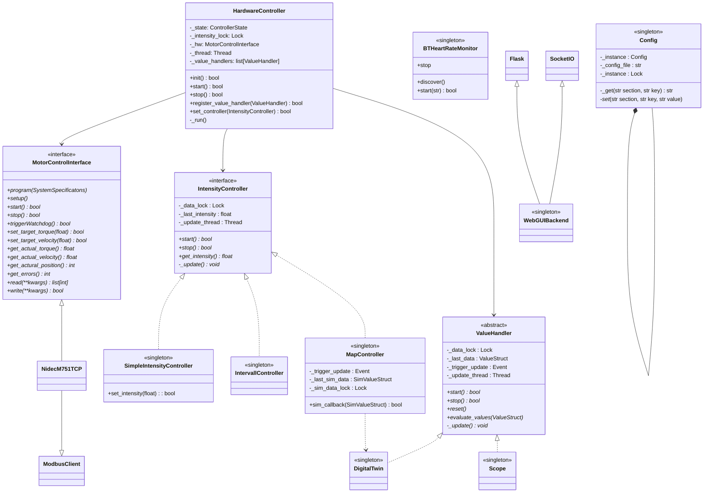
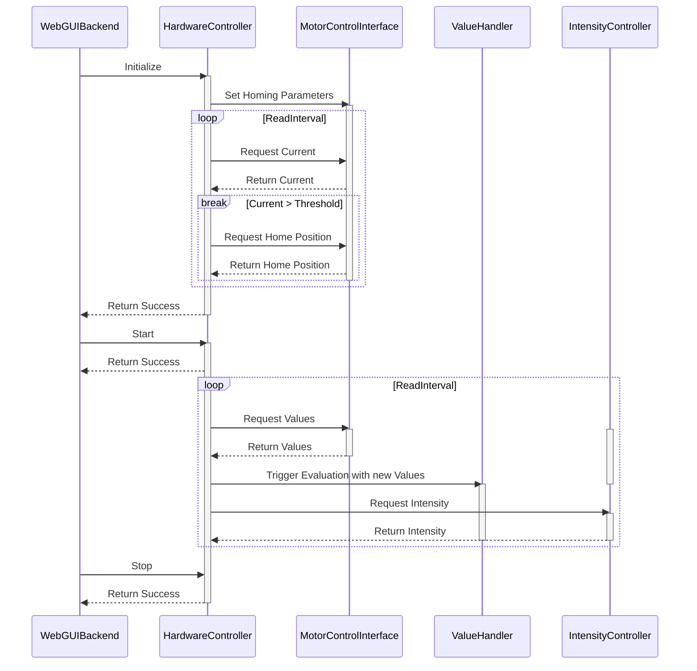

# How to install the Software for XC-FIT v1.0
## Prerequisites
This Project was designed to be run on a Raspberry Pi 5 using the provided Raspberry Pi OS.

The Software was tested with Kernel 6.6

## Install the Software Stack
To install the GUI and control backend, follow the steps below.
1. Clone this repository
    ```
    git clone https://github.com/gianlucapargaetzi/xc-skiing-hometrainer.git
    ```

2. The python sources are running in a virtual environment, which needs to be installed.
    ```
    cd <cloned-repository>/scripts
    ./install_environment.sh
    ```

3. From now on, if you want to work with any xc-skiing sources, make sure your environment is activated.
    ```
    source <cloned-repository>/.venv/bin/activate
    ```
    > You should see a **(.venv)** prefixing your console commands

4. Start the User Interface
    ```
    cd <cloned-repository>/src/webgui
    python3 WebGUIBackend.py
    ```
5. Open the GUI in your browser at `127.0.0.1:5000`

# Code Structure
## Overview
The Code is structured as followed, providing a set of simple Interface to extend the functionality in the future:


## Quick Explanation
### Value Handlers
**evaluate_values** uses *_data_lock* to pass newest drive values to the ValueHandler class and then triggers the *_trigger_update*-Event.
The *_update_thread* (which is running *_update()*) waits for that event to start processing and publishing to SocketIO. *_update_thread* should be registered using SocketIO().start_background_task(_update())

### Intensity Controllers
#### Simple
This is a simple interface object allowing to asynchronosly set and get intensity values in a thread safe manner. Both **get_intensity** and **set_intensity** use *_data_lock* to read / write *_last_intensity*
#### Intervall
This is an "auto-update" object. The thread *_update_thread* (which is running *_update()*) sets the intensity internally and periodically (with specified intervall) from a training programm file in a thread safe manner using *_data_lock* and publishes it to SocketIO. The intensity can be read asychronously with **get_intensity**, which is also using *_data_lock*. *_update_thread* should be registeret using SocketIO().start_background_task(_update())

#### Map
This controller is the most complicated, but works quite similar to the Value Handlers.
**sim_callback** is registered with the DigitalTwin. Once the DigitalTwin calculated a new value, it executes **sim_callback** of the Map Controller, which sets *_last_sim_data* using *_sim_data_lock* and triggers *_trigger_update*
The running *_update_thread* (waiting for *_trigger_update*) then recalculates the intensity, sets *_last_intensity* using *_data_lock* and publishes it to SocketIO. The data can be read thread safe using **get_intensity**. *_update_thread* should be registeret using SocketIO().start_background_task(_update())




